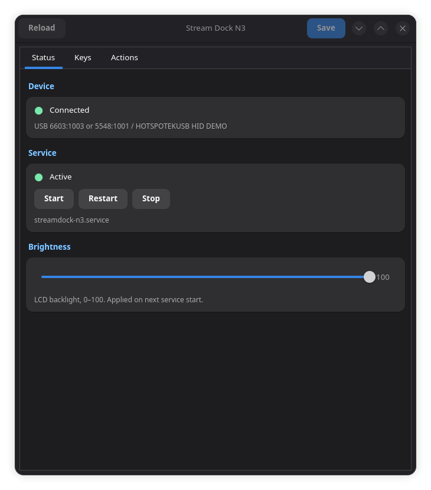
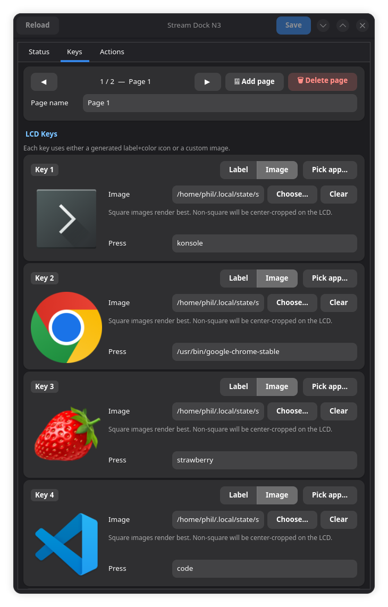
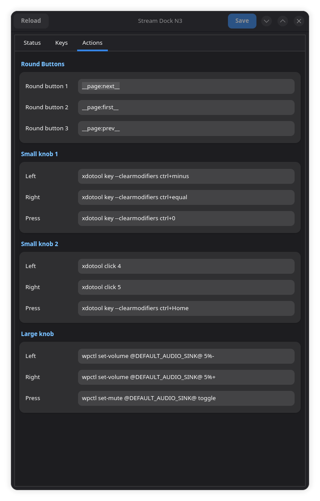

# Stream Dock N3 for Linux

[](https://github.com/asad-albadi/streamdock-n3/releases/latest)
[](https://github.com/asad-albadi/streamdock-n3/actions/workflows/ci.yml)
[](LICENSE)

A daemon and GTK4 GUI that turns the FHOOU / Mirabox **Stream Dock N3** (USB `6603:1003` / `5548:1001`) into a real Linux macropad — bind any of the 6 LCD keys, 3 round buttons, and 3 knobs to shell commands, control volume / media / workspaces, and edit it all from a themed GUI.

## Install

```bash
curl -fsSL https://raw.githubusercontent.com/asad-albadi/streamdock-n3/master/install.sh | bash
```

That's it. The script fetches the latest release wheel, installs it via `pipx` (with `--system-site-packages` so the GUI can import PyGObject), then runs `sudo streamdock-n3-install` to drop the udev rule, systemd user service, and desktop entry. You'll be prompted for your sudo password once.

During system installation, the installer checks USB vendor IDs `6603` (Mirabox) and `5548` (HOTSPOTEKUSB). It always asks you to confirm the rule: if exactly one supported device is connected, that device is the default and Enter confirms it; if both or neither are detected, choose one explicitly. The selected rule is always installed as `/etc/udev/rules.d/99-streamdock.rules`.

The GUI's **Install service** button shows the same device choice. For scripted installs, pass the choice directly:

```bash
sudo streamdock-n3-install --device mirabox
sudo streamdock-n3-install --device hotspotekusb
```

After it finishes:

```bash
systemctl --user daemon-reload
systemctl --user enable --now streamdock-n3.service
```

Unplug and replug the dock once so the new udev rules apply.

### Requirements

- Linux (tested on Arch / Omarchy).
- Python 3.11+, `pipx` (or `pip --user`).
- For the GUI: distro-provided GTK 4 + `python-gobject`. On Arch: `pacman -S gtk4 python-gobject`.
- Optional, for the best theme integration: `libadwaita`.

### Variations

```bash
# Pin to a specific release tag (skip the floating "latest" lookup):
curl -fsSL https://raw.githubusercontent.com/asad-albadi/streamdock-n3/master/install.sh \
    | bash -s -- --version v0.2.0

# Install the wheel only — skip the sudo step that drops system files:
curl -fsSL https://raw.githubusercontent.com/asad-albadi/streamdock-n3/master/install.sh \
    | bash -s -- --no-system

# Pin both the installer and the wheel to one tag (most reproducible):
curl -fsSL https://raw.githubusercontent.com/asad-albadi/streamdock-n3/v0.2.0/install.sh \
    | bash -s -- --version v0.2.0
```

## How it works

- `/dev/hidraw*` — vendor HID interface used by the official SDK for LCD images, brightness, and button reports.
- `/dev/input/event*` — keyboard-style input interface used by some firmware modes for media keys.

The official StreamDock Device SDK is vendored under `src/streamdock_n3/_vendor/StreamDock/` because the pip-installable upstream did not ship the Linux native transport in this environment.

### Manual

```bash
# Use --system-site-packages so the GUI can import the system PyGObject.
pipx install --system-site-packages streamdock-n3-linux   # once PyPI publishing is enabled
sudo streamdock-n3-install                                 # udev rule + systemd unit + desktop entry
systemctl --user daemon-reload
systemctl --user enable --now streamdock-n3.service
```

Without `--device`, `streamdock-n3-install` asks which supported USB device's rule to install. The chosen rule is written to `/etc/udev/rules.d/99-streamdock.rules`.

> **Why `--system-site-packages`?** The GUI uses GTK4 via `python-gobject`, which is provided by the distro and not reliably installable via pip. Sharing the user's site-packages lets `streamdock-n3-gui` import it. The daemon and probe/debug entry points work either way.

Then unplug and replug the Stream Dock so udev rules apply.

### From source

```bash
git clone https://github.com/asad-albadi/streamdock-n3
cd streamdock-n3
pipx install --force .
sudo streamdock-n3-install
```

Or for distro packaging:

```bash
make build
make DESTDIR=$pkgdir DEVICE=hotspotekusb install
```

For distro packaging, set `DEVICE` to `mirabox` or `hotspotekusb` to choose the udev rule explicitly. If omitted, `make install-data` detects connected devices and prompts for confirmation. The selected rule is packaged as `/etc/udev/rules.d/99-streamdock.rules`.

## Commands

After install you have five entry points on your PATH:

```text
streamdock-n3          Daemon. Reads ~/.config/streamdock-n3/config.json,
                       applies LCD icons + brightness, dispatches events.
streamdock-n3-gui      GTK4 GUI for editing the config.
streamdock-n3-probe    SDK smoke test (enumerate, set test icons, print events).
streamdock-n3-debug    Raw hidraw + evdev diagnostics.
streamdock-n3-install  Install selected device udev rule, systemd user unit,
                       desktop entry (run with sudo; accepts --device).
```

`streamdock-n3` flags:

```text
--config PATH       Override config path (default: $XDG_CONFIG_HOME/streamdock-n3/config.json).
--brightness N      Override configured brightness, 0-100.
--dry-run           Print actions without running commands.
--no-icons          Do not update LCD key images.
--no-init           Skip SDK initialization.
--seconds N         Exit after N seconds; useful for tests.
--no-grab           Do not take the dock's input nodes exclusively.
```

## GUI

| Status | Keys | Actions |
|---|---|---|
|  |  |  |

- **Status** detects the dock via `/sys/bus/usb/devices`, exposes Start / Restart / Stop, brightness slider, and an Install button that detects and asks you to confirm the Mirabox or HOTSPOTEKUSB rule before running the privileged installer.
- **Keys** has one card per LCD key. Each key is either **Label** mode (text + background color) or **Image** mode (custom image path, center-cropped to square). **Pick app…** scans `.desktop` files and assigns the chosen app's icon + `Exec` command in one step. Use the **◀ ▶** buttons to navigate between pages, **＋ Add page** to create a new one, and **🗑 Delete page** to remove the current one (disabled when only one page exists). The page name is editable inline.
- **Actions** edits the three round-button and three-knob (left / right / press) command mappings. These are global and apply across all pages.

### Theming

The GUI follows your desktop theme. Colours come from the platform — libadwaita
or your active GTK theme, plus any `@define-color` overrides in
`~/.config/gtk-4.0/gtk.css` — and it tracks the desktop's light/dark preference
live via the XDG portal. The system font is used as-is.

Set `theme` in the config to change that:

```text
system   (default) follow the desktop: its colours, light/dark, accent, font.
light    Force light regardless of the desktop preference.
dark     Force dark regardless of the desktop preference.
omarchy  Take colours from ~/.config/omarchy/current/theme/colors.toml,
         watched live, overriding the GTK theme. This was the behaviour
         before 0.4.0.
```

Notes:

- `libadwaita` is optional but recommended; without it the app falls back to a
  built-in light/dark palette and reads the portal directly. Nothing breaks
  either way. On Arch: `pacman -S libadwaita`.
- `~/.config/gtk-4.0/gtk.css` outranks everything the app sets, including
  `light` and `dark`. That is deliberate — it is your explicit configuration —
  but it means a gtk.css that hardcodes dark colours will keep them under
  `"theme": "light"`.
- If `settings.ini` sets `gtk-application-prefer-dark-theme`, libadwaita logs
  `Using GtkSettings:gtk-application-prefer-dark-theme with libadwaita is
  unsupported`. That warning comes from your GTK config, not from this app —
  every libadwaita app emits it. Removing the line is safe; the portal covers it.

`streamdock-n3-gui --tab N` (0, 1, 2) opens directly on Status / Keys / Actions. Logs go to `$XDG_STATE_HOME/streamdock-n3/gui.log`.

## Configuration

Config lives at `$XDG_CONFIG_HOME/streamdock-n3/config.json` (typically `~/.config/streamdock-n3/config.json`). A default is seeded on first run.

### Pages format (recommended)

```json
{
  "brightness": 80,
  "grab_evdev": true,
  "theme": "system",
  "pages": [
    {
      "name": "Apps",
      "keys": {
        "1": {"label": "Terminal", "color": "#1c63b8"},
        "2": {"label": "Browser",  "color": "#188452"},
        "3": {"label": "Files",    "color": "#b55324"},
        "4": {"label": "Music",    "color": "#8444a8"},
        "5": {"label": "Chat",     "color": "#327a8a"},
        "6": {"label": "Steam",    "color": "#ae365c"}
      },
      "actions": {
        "button.1.press": "konsole",
        "button.2.press": "xdg-open https://",
        "button.3.press": "xdg-open \"$HOME\"",
        "button.4.press": "strawberry",
        "button.5.press": "telegram-desktop",
        "button.6.press": "/usr/bin/steam"
      }
    },
    {
      "name": "Dev",
      "keys": {
        "1": {"label": "VSCode",   "color": "#007acc"},
        "2": {"label": "Terminal", "color": "#1c63b8"},
        "3": {"label": "Browser",  "color": "#188452"},
        "4": {"label": "git pull", "color": "#e06c75"},
        "5": {"label": "git push", "color": "#56b6c2"},
        "6": {"label": "git log",  "color": "#d19a66"}
      },
      "actions": {
        "button.1.press": "code",
        "button.2.press": "konsole",
        "button.3.press": "xdg-open https://",
        "button.4.press": "konsole -e bash -c 'git pull; read'",
        "button.5.press": "konsole -e bash -c 'git push; read'",
        "button.6.press": "konsole -e bash -c 'git log --oneline -20; read'"
      }
    },
    {
      "name": "System",
      "keys": {
        "1": {"label": "Screenshot", "color": "#e5c07b"},
        "2": {"label": "Recorder",   "color": "#e06c75"},
        "3": {"label": "OBS",        "color": "#8444a8"},
        "4": {"label": "Monitor",    "color": "#56b6c2"},
        "5": {"label": "Reboot",     "color": "#be5046"},
        "6": {"label": "Shutdown",   "color": "#ff0000"}
      },
      "actions": {
        "button.1.press": "flameshot gui",
        "button.2.press": "simplescreenrecorder",
        "button.3.press": "obs",
        "button.4.press": "konsole -e btop",
        "button.5.press": "systemctl reboot",
        "button.6.press": "systemctl poweroff"
      }
    }
  ],
  "actions": {
    "button.7.press": "__page:next__",
    "button.8.press": "__page:first__",
    "button.9.press": "__page:prev__",
    "knob.1.left":  "wpctl set-volume @DEFAULT_AUDIO_SINK@ 5%-",
    "knob.1.right": "wpctl set-volume @DEFAULT_AUDIO_SINK@ 5%+",
    "knob.1.press": "wpctl set-mute @DEFAULT_AUDIO_SINK@ toggle",
    "knob.2.left":  "playerctl previous",
    "knob.2.right": "playerctl next",
    "knob.2.press": "playerctl play-pause",
    "knob.3.left":  "wpctl set-volume @DEFAULT_AUDIO_SOURCE@ 5%-",
    "knob.3.right": "wpctl set-volume @DEFAULT_AUDIO_SOURCE@ 5%+",
    "knob.3.press": "wpctl set-mute @DEFAULT_AUDIO_SOURCE@ toggle",
    "evdev.KEY_VOLUMEDOWN.press":   "wpctl set-volume @DEFAULT_AUDIO_SINK@ 5%-",
    "evdev.KEY_VOLUMEUP.press":     "wpctl set-volume @DEFAULT_AUDIO_SINK@ 5%+",
    "evdev.KEY_MUTE.press":         "wpctl set-mute @DEFAULT_AUDIO_SINK@ toggle",
    "evdev.KEY_PREVIOUSSONG.press": "playerctl previous",
    "evdev.KEY_NEXTSONG.press":     "playerctl next",
    "evdev.KEY_PLAYPAUSE.press":    "playerctl play-pause"
  }
}
```

Each entry in `pages` has:
- `name` — displayed in the GUI page navigation bar.
- `keys` — LCD key definitions for that page (label, color, icon).
- `actions` — button.1–6 bindings for that page.

Global `actions` (knobs, evdev, button.7–9) apply across all pages.

### Legacy flat format (still supported)

```json
{
  "brightness": 80,
  "keys": { "1": { "label": "Term", "color": "#1c63b8" } },
  "actions": { "button.1.press": "konsole" }
}
```

If no `pages` key is present the daemon treats the root `keys` and `actions` as a single unnamed page.

### Migrating from flat to pages format

```bash
python migrate_to_pages.py
```

The script moves `keys` and `button.1–6` actions into `pages[0]`, leaves global actions at root, and saves a `.bak` backup of the original.

### Key fields

```text
label    Text rendered into a generated LCD icon.
color    Hex background color for the generated icon. #rgb or #rrggbb.
icon     Optional custom image path. If present and valid, it is used instead.
```

Actions are mapped by event name to a shell command string, a list of
commands (each launched independently), or a `{"command": "..."}` object.

`grab_evdev` (default `true`) makes the daemon the exclusive reader of the
dock's `/dev/input/event*` nodes when — and only when — the config maps at
least one `evdev.*` event. Without it the compositor also acts on the dock's
media keycodes, so a mapped action applies the change a second time (a volume
detent moves 10% instead of 5%). Set it to `false`, or pass `--no-grab`, to
let the compositor keep those keys.

Generated label tiles are cached under `$XDG_CACHE_HOME/streamdock-n3/keys/`
and are safe to delete. Application icons chosen with **Pick app…** are
written to `$XDG_STATE_HOME/streamdock-n3/icons/`, because their paths are
recorded in the config and a cache cleaner would otherwise silently revert
those keys to label tiles.

## Event Names

SDK/HID:

```text
button.1.press through button.9.press
button.1.release through button.9.release
knob.1.left, knob.1.right, knob.1.press, knob.1.release
knob.2.left, knob.2.right, knob.2.press, knob.2.release
knob.3.left, knob.3.right, knob.3.press, knob.3.release
```

Evdev fallback:

```text
evdev.KEY_NAME.press
evdev.KEY_NAME.release
evdev.KEY_NAME.repeat
```

Page switching (special actions, for use in global `actions`):

```text
__page:next__    Switch to next page (wraps around).
__page:prev__    Switch to previous page (wraps around).
__page:first__   Switch to first page.
__page:last__    Switch to last page.
__page:N__       Switch to page N (zero-based index).
```

Default mapping:

```text
Page: Apps
1  Terminal  konsole              knob 1  speaker volume / mute
2  Browser   xdg-open https://      knob 2  media prev/next / play-pause
3  Files     xdg-open "$HOME"       knob 3  mic volume / mute
4  Music     strawberry             button 7  page next
5  Chat      telegram-desktop       button 8  page first
6  Steam     /usr/bin/steam         button 9  page prev

Page: Dev
1  VSCode    code
2  Terminal  konsole
3  Browser   xdg-open https://
4  git pull  konsole -e bash -c 'git pull; read'
5  git push  konsole -e bash -c 'git push; read'
6  git log   konsole -e bash -c 'git log --oneline -20; read'

Page: System
1  Screenshot  flameshot gui
2  Recorder    simplescreenrecorder
3  OBS         obs
4  Monitor     konsole -e btop
5  Reboot      systemctl reboot
6  Shutdown    systemctl poweroff
```

## Diagnostics

```bash
streamdock-n3-debug --seconds 20
streamdock-n3-probe --no-icons --map
```

Press all keys, knobs, and rotations while `streamdock-n3-debug` runs. If you see an `evdev.KEY_...` name that is not in your config, add it under `actions`.

## Troubleshooting

If buttons do nothing:

```bash
sudo streamdock-n3-install
# unplug + replug the dock
ls -l /dev/hidraw* /dev/input/event*
```

Dry-run to inspect what the daemon would do:

```bash
streamdock-n3 --dry-run
```

### Alternative USB variant (HOTSPOTEKUSB, `5548:1001`)

Some units are sold under the HOTSPOTEKUSB brand with a different USB ID (`5548:1001`). These use the same HID protocol and are fully supported. If `streamdock-n3-probe` does not detect your device, verify with:

```bash
lsusb | grep -i hotspot
```

If the ID is `5548:1001` the device is supported out of the box — no extra configuration needed.

## Development

```bash
uv sync --extra dev
uv run pytest
uv run ruff check .
```

Build a wheel:

```bash
uv build
```

Release flow:

```bash
# bump version in pyproject.toml, commit, tag, push:
git tag v0.2.1
git push --tags
# GitHub Actions builds the wheel + sdist and publishes the release.
```

## Project Files

```text
src/streamdock_n3/
  daemon.py          Daemon (streamdock-n3 entry point).
  gui.py             GTK4 GUI (streamdock-n3-gui).
  probe.py           SDK smoke test (streamdock-n3-probe).
  debug_tool.py      Raw hidraw + evdev diag (streamdock-n3-debug).
  system_install.py  Install udev/service/desktop (streamdock-n3-install).
  config.py          XDG config IO + defaults.
  events.py          Event name mapping.
  icons.py           Generated LCD icons + color parsing.
  paths.py           XDG path helpers.
  theme.py           System-theme-driven styling (pure; no gi import).
  shutdown.py        Hard-exit helper (skips the SDK's unsafe close path).
  _data/             Packaged udev rule, systemd unit, desktop entry, default config.
  _vendor/StreamDock/  Vendored official SDK + native transport.

tests/               Unit tests.
migrate_to_pages.py  One-shot migration from flat config to pages format.
.github/workflows/   CI + release workflows.
Makefile             Source-tree installer for distro packagers.
install.sh           One-shot end-user installer.
```

## Known Limitations

- Not a full clone of the Windows/macOS Stream Dock software UI.
- Pages (multi-profile LCD layouts) are supported via the `pages` config key. The GUI supports adding, removing, and renaming pages.
- Actions are shell commands in JSON.
- Knob event names may vary by firmware mode — use `streamdock-n3-debug` to confirm.
- Whether the dock also emits media keycodes to the compositor depends on the
  firmware mode; `grab_evdev` exists for the modes where it does.
- The vendored SDK is bundled because the upstream pip package did not include the Linux native transport in this environment.
